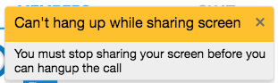

# Component Name:  AlertItem   #
# 1. Functional Description #

AlertItem is a simple list item component used in the AlertList component. The alerts will display in AlertList for 5 seconds then timeout or they can be dismissed by clicking the RemoveIconSVG (the 'x' in the top right corner). Based on the level, the alert heading will change color: "error" = red (*#FD5F56*), "warn" = yellow (*#FFC02F*) as shown, & "info" = green *(#63B653*)

# 2. Visual Design #

 - Alert Item: 

# 3. Component Type #

This is a ‘pure' component.

## a. Required Props ##

| Prop Name | Sample | Description |
| ------------ | ------------- | ------------- |
| alertData | alertData={level:"warn", timestamp:1466703201123, summary: "Can't hang up while sharing screen",  detail: "You must stop sharing your screen before you can hangup the call",  id: 0} | An object. Required. Contains the data for alerts.|
| cbDismissAlert | Function implemented and bound to a higher-order parent container of this component | Function. Required. This prop is invoked when clicking the RemoveIconSVG to dismiss an alert, removing from alert list. |
|compStyle |  _NOTE styles are in JSX, not CSS_ { alertItemStyles : {display: 'flex',border: '1px solid #d1d1d1', backgroundColor: '#FFF'} } | Optional prop. If value is provided, then it will render new styles, if not it will render default styling. |
| index | index: 0 | Number. Indexes each alertItem.

## b. Component State ##

## c .Component Events ##

| Event | Action(s) |
| ------------ | ------------- |
| 'RemoveIconSVG' clicked | 1. Callback function invoked. 2. State Change. 3. Specific alert is removed from alertList. |

## d. Context-Aware Specification ##

This component is a pure component and it will maintain it’s own state.

# 4. Reference Components #

The component to be developed requires the following components:

- VertoBaseComponent
- ControlItem

# 5. Unit Testing Requirement #
Tests for this component are located at:

        src/tests/alertItem-test.js
