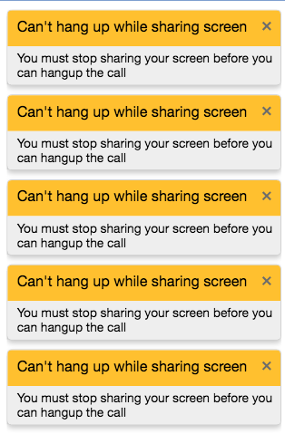

# Component Name:  AlertList   #
# 1. Functional Description #

AlertList is a basic list component that displays the AlertItem components. The alerts will display for 5 seconds then timeout or they can be dismissed by clicking the RemoveIconSVG (the 'x' in the top right corner). 

# 2. Visual Design #

 - Alert List: 

# 3. Component Type #

This is a ‘pure' component.

## a. Required Props ##

| Prop Name | Sample | Description |
| ------------ | ------------- | ------------- |
|compStyle |  _NOTE styles are in JSX, not CSS_ { alertItemStyles : { display: 'flex',border: '1px solid #d1d1d1', backgroundColor: '#FFF'} } | Optional prop. If value is provided, then it will render new styles, if not it will render default styling. |

## b. Component State ##

## c .Component Events ##

| Event | Action(s) |
| ------------ | ------------- |
| 'RemoveIconSVG' clicked | 1. Callback function invoked. 2. State Change. 3. Specific alert is removed from alertList. |

## d. Context-Aware Specification ##

This component is a pure component and it will maintain it’s own state.

# 4. Reference Components #

The component to be developed requires the following components:

- VertoBaseComponent
- AlertItem

# 5. Unit Testing Requirement #
Tests for this component are located at:

        src/tests/alertList-test.js
