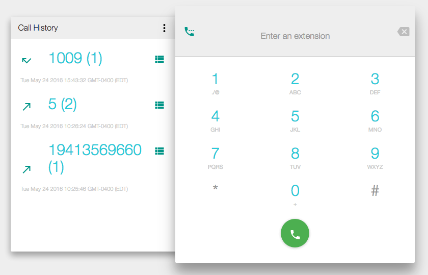

# Component Name:  CallHistory  #
# 1. Functional Description #

CallHistory renders a list containing information about previously made calls.

# 2. Visual Design #  

# 3. Component Type #

This component will be a 'pure' component.

## a. Required Props ##

| Prop Name | Sample | Description |
| ------------ | ------------- | ------------- |
| history | history=[]  | A required prop that is an array. |
| compStyle |  NOTE styles are in JSX, not CSS  { inputWrapStyle: {backgroundColor: '#ddd'} inputStyle {fontSize: '1rem'} } | An optional property that customizes component style. |
| cbBack | cbBack={()=>{}}  | A required function. |

## b. Component State ##

This component will maintain it's own state for presentational purposes.

## c .Component Events ##

Event | Action(s)
------------ | -------------
'Clear History' Clicked | 1. callback function invoked.   2. Event Dispatched 3. Component renders blank list.
'Back' clicked | callbackfunction invoked.   2. State is changed 3. New Screen Rendered
'Hamburger' Menu Clicked | 1. Callback function invoked   2. State Change  3. New Screen rendered
'ChatHistoryItem' clicked | 1. callback function invoked.  2. Event Dispatched.  

## d. Context-Aware Specification ##

The CallHistory component is NOT context-aware.

# 4. Reference Components #

- ReactIntl
- Radium
- VertoBaseComponent
- CallHistoryItem
- moment.js

# 5. Unit Testing Requirement #

- displays a list of objects containing call history info.
- displays a list of timestamps
- clears call history
