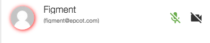
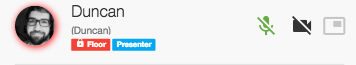

# Component Name:  MemberItem  #
# 1. Functional Description #

This component creates the member item for a video session. It is a rectangular display showing user avatar, name, email, and 2 icons (microphone & video). The icons are clicked to mute/unmute audio and/or video. Badges will appear across the bottom to indicate when the user has the Floor, when the Floor is locked,  when Screen Share is enabled, and Presenter Status.

# 2. Visual Design #  

Floor and presenter badges:

Floor locked badge: 

# 3. Component Type #

This component will be a 'pure' component.

## a. Required Props ##

| Prop Name | Sample | Description |
| ------------ | ------------- | ------------- |
| cbControlClick |  Function implemented and bound to a higher-order parent container of this component. | Function. Required. This prop is invoked when a control is used by clicking a control icon. |
| controlSettings: moderator: React.PropTypes.bool, multCanvas: React.PropTypes.bool, allowPresenter: React.PropTypes.bool |  isModerator={confData.currentRole == "moderator"} allowPresenter={true} hasMultipleCanvases={false} | Object. Required. Contains the data for the control settings.
| member | member={} | Object. Required. Contains all necessary member data. |

## b. Component State ##

This component will maintain it's own state for presentational purposes.

## c. Context-Aware Specification ##

his component is NOT a context-aware component

# 5. Reference Components #

- VertoBaseComponent
- AdminControls
- ControlItem
- SvgIcons

# 6. Unit Testing Requirement #
Tests for this component are located at:

        src/tests/memberItem-test.js
