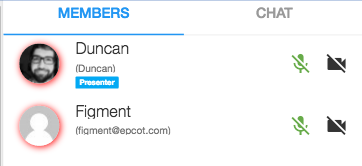

# Component Name:  MemberList   #
# 1. Functional Description #

This component creates the list of member items.

# 2. Visual Design #  

# 3. Component Type #

This component will be a 'pure' component.

## a. Required Props ##

| Prop Name | Sample | Description |
| ------------ | ------------- | ------------- |
| allowPresenter |  allowPresenter = { true } | Boolean. Not required. This prop toggles presenter |
| compStyle | compStyle = {} | This prop provides style for the the member list. |
| hasMultipleCanvases |  hasMultipleCanvases = { true } | Boolean. Not required. This prop toggles multiple canvases |
| members | members = [] | Array. Not required. Contains list of current members |
| isModerator | isModerator = { true }  | Boolean. Not required. This prop toggles  moderator status. |

## b. Component State ##

  This component will maintain it's own state for presentational purposes.

## c. Context-Aware Specification ##

  his component is NOT a context-aware component

# 4. Reference Components #

- VertoBaseComponent
- MemberItem

# 6. Unit Testing Requirement #
Tests for this component are located at:

        src/tests/memberList-test.js
