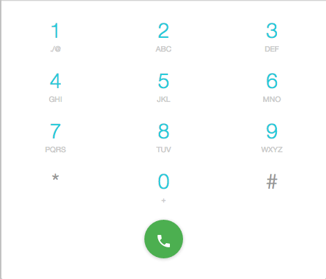

# Component Name:  Numberpad   #
# 1. Functional Description #

Numberpad is an area that displays numbers and corresponding characters/symbols used for dialing phone numbers.

# 3. Visual Design #  

# 4. Component Type #

This component will be a 'pure' component.

## a. Required Props ##

| Prop Name | Sample | Description |
| ------------ | ------------- | ------------- |
| compStyle | compStyle={} | compStyle is an optional prop that defines styles for the Numberpad component. |
| cbClick |  cbClick={()=>{}}| cbClick is a required function. |
| keyValue |  keyValue="2" | keyValue is a required prop that has a string value that is rendered in each numberItem |
| keyString |  keyString="ABC" | keyString is a required prop that has a string value that is rendered in each numberItem |

## b. Component State ##

This component will not maintain its own state.  It will change as new prop values are passed into it from its parent.

## c .Component Events ##

|Event | Action(s)|
|------------ | -------------|
|{NumberItem} clicked | 1 .Invoke the callback function cbClick(). |

## d. Context-Aware Specification ##

This component is NOT context-aware.

# 5. Reference Components #

- VertoBaseComponent
- SvgIcons
- Radium
- ReactIntl

# 6. Unit Testing Requirement #

- It simulates a click event.
- It renders a keyValue prop.
- It renders a keyString prop.
