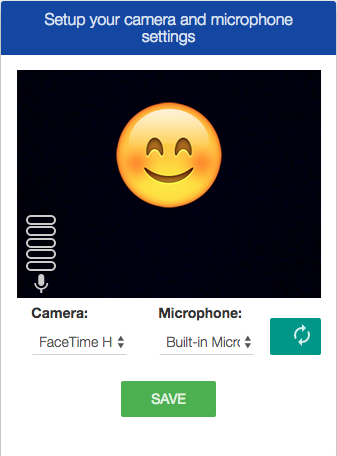

# Component Name:  Settings   #
# 1. Functional Description #

The Settings Menu is a large dropdown menu that drops down under the **App Bar** when the **settings icon** in clicked.  The settings menu will stretch to full length of the App Bar (which is also the full width of the window). The Settings menu will be horizontal three column layout until the window width is resized to 991px or smaller. At this point, the columns will stack vertically. This will be handled (hopefully) through flexbox.
The entire menu consists of five areas in a three column format: media, General Settings, Language, Audio Settings, and Video Settings. 
The first column contains a media area. It is designated with headings for **Camera:**, **Share Device**, **Microphone:**, **Speaker:**, and **Best Frame Rate:** with select menus underneath. At the bottom of this column are two buttons positioned one above the other. The top button is labelled **Preview Settings**. The bottom button is labelled **Refresh Device List**. **Preview Settings** opens a modal with Camera and Microphone settings choices (see image). 
The second column consists of General Settings, Language, and Audio Settings areas. Under the **General Settings:** header is a list of five checkboxes (1.Use Video, 2.Stereo Audio, 3.Use STUN, 4.Scale Remote Video, 5.Ask Before Recovering Call). **Language:** has a select menu to choose your language. **Audio Settings** is a list of three checkboxes (1.Echo Cancellation, 2.Noise Suppression, 3.Highpass Filter). 
The third column consists of the Video Settings with two checkboxes under the **Video Settings:** header (1. Automatically Determine Speed and Resolution Settings & 2. Recheck Bandwidth Before Each Outgoing Call). Below that is a button labelled **Check Network Settings**. When "Automatically Determine Speed and Resolution Settings" is unchecked, a secondary list of select menus replaces the Check Network Settings button (see image). The three headings are (1. Video Quality, 2.Max Incoming Bandwidth, 3. Max Outgoing Bandwidth) 
The default settings data will be passed in as the prop: **data**. 
For Internationalization all text will be passed in as Formatted Messages with an id labelling the text and a default message the text as a string.

# 2. Visual Design #  

 - Full Settings Dropdown Menu:

 - Secondary Video Settings shown when "Automatically Determine Speed and Resolution Settings" NOT selected:

 - Modal appears when "Preview Settings" button clicked:

# 3. Component Type #

This is a ‘pure' component.

## a. Required Props ##

If the prop is an object, a sample of the object structure needs to be provided.
If the prop is a callback function, then a sample of the function call including input arguments and their data types must be provided.  If an argument is an object, then a sample of its structure must be provided.

Sample:

| Prop Name | Sample | Description |
| ------------ | ------------- | ------------- |
| settingsData | settingsData={ askRecoverCall: false,  autoBand: true,  bestFrameRate: [id:"15",label:"15 FPS"],  googEchoCancellation: true,  googNoiseSuppression: true,  incomingBandwidth: "default",  language:"en", languages:[id:"en", name:'"English"]  mirrorInput: false,  outgoingBandwidth: "default",  selectedAudio: []  selectedBestFrameRate: [], selectedShare: [],  selectedSpeaker: [],  selectedVideo: [], testSpeedJoin: true, useDedence: false, useSTUN: true, useStereo: true, vidQual:undefined | An object. Required. Contains the settings data for each field.  
| compStyle |  _NOTE styles are in JSX, not CSX_ {   container: {display: 'flex',  position: 'relative'},   inputStyle: {fontSize: '1rem'} } | Optional prop. If value is provided, then it will render new styles, if not it will render default styling. |
| cbToggleShowSettings |  Function implemented and bound to a higher-order parent container of this component | Function. Required. This prop controls the dropdownDisplayed state. |
| cbPreviewSet | Function implemented and bound to a higher-order parent container of this component | Function. Required. This prop is invoked when the **Preview Settings** button is clicked.|
| cbDeviceList | Function implemented and bound to a higher-order parent container of this component | Function. Required. This prop is invoked when the **Refresh Device List** button is clicked.|
| cbNetSpeed | Function implemented and bound to a higher-order parent container of this component | Function. Required. This prop is invoked when the **Check Network Speed** button is clicked.|
| cbSubmitSetting | Function implemented and bound to a higher-order parent container of this component | Function. Required. This prop is invoked when a setting is changed by either selecting a menu item or checking a box. |

## b. Component State ##

This component will maintain it's own state for dropdownDisplayed.

This component is a drop down menu and will toggle between up and down based on click of a button(SettingsIconSVG).
Initial state:
State = {dropdownDisplayed: false}  // menu is initially 'up'
onClick of button
	// set dropdownDisplayed to the inverse of its current value
this.setState({...this.state, dropdownDisplayed: !this.state.dropdownDisplayed});

## c .Component Events ##

If the component needs to react to events (clicks, key presses, etc.) then those events should be listed here along with the action that should be taken:

Sample:

Event | Action(s)
------------ | -------------
Settings icon clicked | Invoke the callback function cbClick(), dropdownDisplayed state is toggled.
Camera Menu clicked | cbSubmitSetting()
Share screen Menu clicked | cbSubmitSetting()
Microphone Menu clicked | cbSubmitSetting()
Speaker Menu clicked | cbSubmitSetting()
Best frame rate Menu clicked | cbSubmitSetting()
Preview Settings Button | Invoke the callback function cbPreviewSet(), when button clicked.
Refresh Device List Button | Invoke the callback function cbDeviceList(), when button clicked.
Use Video checkbox | cbSubmitSetting()
Stereo Audio checkbox | cbSubmitSetting()
Use STUN checkbox | cbSubmitSetting()
Scale Remote Video to Match Camera Resolution checkbox | cbSubmitSetting()
Ask Before Recovering a Call checkbox | cbSubmitSetting()
Language menu clicked | cbSubmitSetting()
Echo Cancellation checkbox | cbSubmitSetting()
Noise Suppression checkbox | cbSubmitSetting()
Highpass filter checkbox | cbSubmitSetting()
Automatically Determine Speed and Resolution Settings checkbox *additional menu | cbSubmitSetting()
 *Video Quality Menu clicked | cbSubmitSetting()
 *Max Incoming Bandwidth Menu clicked | cbSubmitSetting()
 *Max Outgoing bandwidth Menu clicked | cbSubmitSetting()
Recheck Bandwidth Before Each Outgoing Call checkbox | cbSubmitSetting()
Check Network Speed Button| Invoke the callback function cbNetSpeed(), when button clicked.

## d. Context-Aware Specification ##

This component is a pure component and it will maintain it’s own state.

# 4. Reference Components #

The component to be developed requires the following components:

- vertobasecomponent
- svgIcons
- react-intl

# 5. Unit Testing Requirement #
Tests for this component are located at:

        src/tests/settings-test.js
