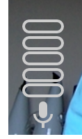

# Component Name: volumeMeter #
# 1. Functional Description #

This component displays a 'meter' indicating relative volume for the audio setting.  

# 2. Visual Design #

# 3. Component Type #

This component will be a 'pure' component.

## a. Required Props ##

| Prop Name | Sample | Description |
| ------------ | ------------- | ------------- |
| compStyle | compStyle = {} | This prop is an object and is not required. This object sets the style for this component |
|volumeLevel| volumeLevel= 0| This prop is a number expected to between 0 and 100.  If a number > 100 is entered, all level segments will be filled, and if a number less than 0 is entered, no level segments will be filled.

## b. Component State ##
This is a 'pure' component.

## c. Context-Aware Specification ##

This component is a 'pure' component.

# 4. Reference Components #

* vertobase component

# 5. Unit Testing Requirement #

 Tests can be found in src/tests
